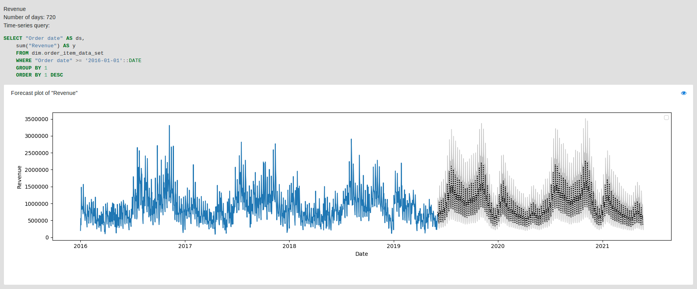
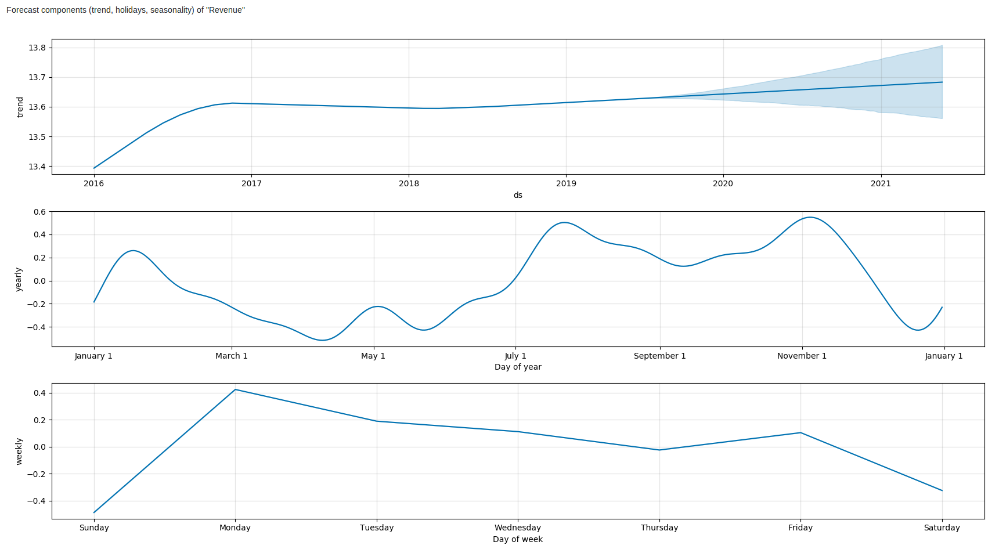
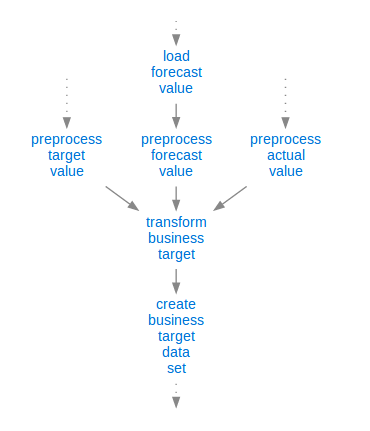

# Mara Prophet

A lightweight framework for producing, integrating and historizing [Facebook-prophet](https://github.com/facebook/prophet) 
forecasts for time series data in Mara.

Mara prophet is a laconic and simplified python module for integrating and historizing high quality forecasts for time series data 
produced with [Facebook-prophet](https://github.com/facebook/prophet) 
by absolving on the same time the overhead of integration and multiple configurations.

Mara-prophet provides a framework for:

- Producing, validating and historizing Facebook prophet's models and forecasts
- On demand database integration (currently PostgreSQL only) of the historical time series and forecasts for ease of ETL and further reporting processing
- Visualizing, on demand, the analysis results as standalone KPI charts using the [mara-page](https://github.com/mara/mara-page) module
- Time series component analysis containing trend, yearly/weekly seasonality and holiday effects

## Resulting data

The historical time series and the resulting data are stored, on demand, in a user-specified table 
and are currently structured as:

```SQL
metric_date  DATE, -- Date of current's metric value
metric_name  TEXT, -- Name of the current metric
metric_value DOUBLE PRECISION, -- Metric's value (historical or forecasted) with respect to the metric_date
lower_ci     DOUBLE PRECISION, -- Lower confidence interval forecasted value
upper_ci     DOUBLE PRECISION  -- Upper confidence interval forecasted value

Primary Keys: metric_date, metric_name
```

While multiple metrics and their respective forecasts can be integrated in the same table.

Mara prophet comes packed with a default visualization of the historical and forecasting data along with a component analysis. 
Both highlighted in an auto-migrated python ```Flask``` view by using the [mara-page](https://github.com/mara/mara-page) module,
for ease of integration in Mara-applications.
An example of this view is highlighted below:




Basic configurations are provided for ease of Mara integration, 
with data and fitted models stored in a PostgreSQL database, on demand,
by using the [mara-db](https://github.com/mara/mara-db) module and structured as:

```SQL
id                INTEGER,
metric_name       TEXT,
forecast_ts       TIMESTAMP, -- Forecast timestamp
forecasts_df      BYTEA, -- Serialized forecasts' dataframe (pandas)
source_df         BYTEA, -- Serialized source dataframe (pandas)
components_figure BYTEA, -- Serialized forecast component's figure
hyper_parameters  JSONB  -- fbprophet configuration used

Primary Keys: metric_name, forecast_ts
```

The main aim of this table is to allow analysing the performance of the prediction models and asynchronously 
rendering the forecast and component plots.

### Installation

(Requires Python 3.6 or later)

Via pip:

```console
pip install --git+https://github.com/project-a/mara-prophet.git
```

Or clone the repository and then:

```console
cd mara-prophet
python3 -m venv .venv
.venv/bin/pip install --upgrade pip
.venv/bin/pip install .
```

## Getting Started

One or more PostgreSQL database connections needs to be configured for 
storing historical time-series, forecasts, configurations and metadata of the models used and run:

```python
import mara_db.config
import mara_db.dbs

# Mara-db databases connections configurations for different aliases
mara_db.config.databases = lambda: {
    # Main database connection alias for:
    # 1. retrieving the historical time-series data used for training the model
    # 2. storing the generated forecasts on demand
    'dwh-etl': mara_db.dbs.PostgreSQLDB(user='root', host='127.0.0.1', port=5432, database='dwh'),
    
    # On demand 'mara' db-alias responsible for:
    # 1. enabling the mara-prophet components default view in Mara applications
    # 2. historizing latest mara-prophet models attributes
    'mara': mara_db.dbs.PostgreSQLDB(user='root', host='127.0.0.1', port=5432, database='mara')
}
```
The main input that Mara-prophet requires is a list of `Forecast` objects that can be defined by overwriting 
the forecasts function in [mara_prophet/config.py](mara_prophet/config.py).
In addition, required and on demand configurations are highlighted in the configuration example below:

```python
import mara_prophet.config
from mara_prophet import sql
from mara_prophet.forecast import Forecast

# Required database alias for retrieving the training (source) data-set and for storing the generated forecasts
mara_prophet.config.db_alias = lambda: 'dwh-etl'

# Required table definition for storing the generated forecasts (skipped, if not specified)
mara_prophet.config.forecast_table_name = lambda: 'dim.forecast'

mara_prophet.config.forecasts = lambda: [
    Forecast(
        metric_name='Revenue',
        number_of_days=180, # Number of consecutive days of produced forecasts
        time_series_query=mara_prophet.sql.build_time_series_sql_query(
            schema_name='dim',
            table_name='order',
            ds_column='"Order date"',
            y_expression='sum("Revenue")',
            where_condition='"Order date" >= \'2019-06-01\'::DATE')
    ),
    # ...
]
```

In order to run a time-series analysis for each defined `Forecast` object, the ```run_forecast(metric_name: str)``` function
needs to be triggered, providing the name of the current metric to be forecasted:

```python
from mara_prophet.forecast import run_forecast, create_forecast_table

# One time creation of the forecasts database table
create_forecast_table()

# Run forecast by metric name
run_forecast('Revenue')
```

### Usage and ETL-integration

One obvious use-case can be considered by transforming and combining forecasting data of a pre-defined set of metrics (KPIs)
 with their respective actual and target values.

Such an example ```Business-targets``` ETL pipeline is highlighted below 
with the arrows defining the current dependency graph among the ETL individual nodes (jobs):



The main output of such a pipeline can be a `business_target_dataset` table with a structure as below:

```SQL
"Metric"   TEXT, -- Name of the current metric
"Date"     DATE, -- Date dimension
"Actual"   DOUBLE PRECISION, -- Actual aggregated value of the current "Metric" with respect to "Date"
"Target"   DOUBLE PRECISION, -- Target aggregated value of the current "Metric" with respect to "Date"
"Forecast" DOUBLE PRECISION  -- Forecasted value of the current "Metric" with respect to "Date"

Primary Keys: "Metric", "Date"
```

By integrating the forecasting results in such a pipeline, we can aim for the following:

- Benchmarking for judging KPI performance and target setting (over/under-estimations)
- Metrics’ breakdowns analysis. Ability to detect different seasonality and trend per any meaningful level  (i.e. country) 
by running multiple forecast models (one per each relevant level value)
- Identifying current weaknesses and strengths before they happen (anomaly detection)
- Further combined reporting and visualizations

## Further notes
Facebook-prophet modeling is fast due to models fitted in [Stan](https://mc-stan.org/) and robust by automatically handling 
trend changes, outliers, missing data and crucial change-points in the historical time-series. More about the Facebook-prophet's 
modeling and inner mechanisms can be found at the official docs [here](https://facebook.github.io/prophet/).

Therefore, Mara-prophet is proved to work better on data with strong multi-seasonal effects and 
can be easily used in several cases and pipelines that involve reliable KPI forecasting which can enable useful insights.
